# ♻️ Reuso Tech — Projeto A3

> Aplicação web responsiva para coletar, avaliar, recuperar e destinar equipamentos eletrônicos a estudantes e pessoas em situação de vulnerabilidade digital, com apoio de ONGs e instituições de ensino.


## 📌 Sobre o projeto

### Problema

Equipamentos eletrônicos potencialmente reutilizáveis são descartados enquanto estudantes e outras pessoas não possuem acesso adequado à tecnologia. Além do desperdício ambiental, faltam processos transparentes para receber, avaliar, recuperar e entregar esses equipamentos.

### Solução

Uma plataforma que oferece **rastreabilidade para todo o ciclo**:

```
Doação → Recebimento → Triagem → Reparo ou Reciclagem → Solicitação validada → Associação → Entrega → Mensuração do impacto
```

### Proposta de valor

- Prolongar a vida útil de equipamentos eletrônicos;
- Apoiar a inclusão digital e educacional;
- Facilitar a atuação de ONGs e instituições de ensino;
- Registrar a destinação ambiental dos itens irrecuperáveis;
- Tornar o impacto social e ambiental mensurável.

## 🌍 Relação com os ODS

| ODS | Relação com a Reuso Tech |
| --- | --- |
| **ODS 12 — Consumo e Produção Responsáveis** (principal) | Reutilização, recuperação e destinação ambientalmente adequada de eletrônicos |
| ODS 4 — Educação de Qualidade | Ampliação do acesso de estudantes a computadores e outros recursos tecnológicos |
| ODS 10 — Redução das Desigualdades | Promoção da inclusão digital de pessoas em situação de vulnerabilidade |

## 👥 Atores

| Ator | Responsabilidade no sistema |
| --- | --- |
| Pessoa doadora | Cadastrar e entregar equipamentos; acompanhar o andamento da doação |
| Organização parceira | Receber doações, validar solicitações e apoiar a distribuição |
| Integrante da equipe técnica | Realizar triagens, registrar diagnósticos e executar reparos |
| Administrador | Gerenciar usuários, organizações, equipamentos, associações e indicadores |
| Pessoa beneficiária | Receber o equipamento; no MVP, pode ser representada pela organização parceira |

> 🔒 **Princípio de privacidade:** o MVP armazena somente os dados pessoais indispensáveis. A organização parceira valida a solicitação sem expor publicamente informações socioeconômicas da pessoa beneficiária.

## 🔄 Fluxo principal

```mermaid
flowchart LR
    classDef acao fill:#dbeafe,stroke:#3b82f6,color:#0f172a
    classDef positivo fill:#dcfce7,stroke:#22c55e,color:#0f172a
    classDef analise fill:#ffedd5,stroke:#f97316,color:#0f172a
    classDef pendencia fill:#fee2e2,stroke:#ef4444,color:#0f172a
    classDef marco fill:#1f2937,stroke:#111827,color:#ffffff

    subgraph FLUXO_EQ["1 · Fluxo do equipamento"]
        direction LR
        eq_ini([Início]):::marco --> eq_cad["Cadastrar doação<br/>Doador informa o equipamento"]:::acao
        eq_cad --> eq_rec["Confirmar recebimento<br/>Organização parceira"]:::acao
        eq_rec --> eq_tri["Realizar triagem<br/>Equipe técnica avalia o item"]:::analise
        eq_tri --> eq_cond{"Condição do equipamento?"}:::analise
        eq_cond -- "Pronto" --> eq_disp["Disponibilizar equipamento<br/>Item pronto para destinação"]:::positivo
        eq_cond -- "Peças / reciclagem" --> eq_dest["Registrar destinação ambiental<br/>Peças ou reciclagem"]:::pendencia
        eq_cond -- "Reparo" --> eq_rep["Executar reparo<br/>Registrar serviço e peças"]:::analise
        eq_rep --> eq_apr{"Reparo aprovado?"}:::analise
        eq_apr -- "Sim" --> eq_disp
        eq_apr -- "Não" --> eq_dest
        eq_dest --> eq_fim([Fim]):::marco
    end

    subgraph FLUXO_SOL["2 · Fluxo da solicitação"]
        direction LR
        sol_ini([Início]):::marco --> sol_reg["Registrar solicitação<br/>Necessidade do beneficiário"]:::acao
        sol_reg --> sol_val["Validar solicitação<br/>ONG ou instituição parceira"]:::acao
        sol_val --> sol_apr{"Solicitação aprovada?"}:::analise
        sol_apr -- "Sim" --> sol_fila["Incluir na fila<br/>Solicitação apta à associação"]:::positivo
        sol_apr -- "Não" --> sol_pend["Notificar pendência<br/>Complementar ou encerrar"]:::pendencia
    end

    subgraph FLUXO_DST["3 · Associação, entrega e encerramento"]
        direction TB
        dst_assoc["Associar equipamento à solicitação<br/>Processo manual realizado pelo administrador ou ONG"]:::acao
        dst_assoc --> dst_res["Reservar equipamento<br/>Bloquear dupla destinação"]:::acao
        dst_res --> dst_ent["Registrar entrega<br/>Data, responsável e organização"]:::positivo
        dst_ent --> dst_conf["Confirmar recebimento<br/>Beneficiário ou instituição confirma"]:::positivo
        dst_conf --> dst_ind["Atualizar indicadores<br/>Recebidos · recuperados · entregues · reciclados"]:::positivo
        dst_ind --> dst_fim([Fim]):::marco
    end

    eq_disp -- "Equipamento disponível" --> dst_assoc
    sol_fila -- "Solicitação aprovada" --> dst_assoc
```



_Legenda: 🔵 ação do sistema · 🟢 resultado positivo · 🟠 análise técnica · 🔴 pendência ou descarte._

1. A pessoa doadora cadastra o equipamento.
2. A organização parceira confirma o recebimento.
3. A equipe técnica realiza a triagem.
4. O equipamento é classificado:
   - **Pronto para uso** → torna-se disponível;
   - **Precisa de reparo** → abertura de ordem de reparo;
   - **Peças ou reciclagem** → destinação ambiental registrada.
5. Em paralelo, uma solicitação é registrada e validada por uma organização parceira.
6. A solicitação aprovada entra na fila de atendimento.
7. Um equipamento disponível é associado manualmente à solicitação.
8. O sistema reserva o item, registra a entrega e recebe a confirmação.
9. Os indicadores sociais e ambientais são atualizados.

### Ciclo de status do equipamento

| Status | Significado |
| --- | --- |
| Oferecido | Doação cadastrada, ainda não recebida |
| Recebido | Item entregue à organização parceira |
| Em triagem | Equipamento em avaliação técnica |
| Em reparo | Equipamento aguardando ou passando por reparo |
| Disponível | Aprovado para destinação |
| Reservado | Associado a uma solicitação aprovada |
| Entregue | Entrega realizada e registrada |
| Peças | Separado para aproveitamento de componentes |
| Reciclagem | Encaminhado para destinação ambiental |
| Encerrado | Ciclo concluído |

## ⚙️ Funcionalidades do MVP

- **Cadastro e acesso:** cadastro de doadores, organizações parceiras e equipe técnica; autenticação e permissões por perfil.
- **Gestão das doações:** cadastro do equipamento (tipo, marca, modelo, estado aparente, acessórios, observações e fotos), confirmação de recebimento e histórico da doação.
- **Triagem técnica:** registro da avaliação, defeitos encontrados, classificação (pronto para uso / reparo / peças / reciclagem) e parecer técnico com data.
- **Controle de reparos:** abertura de ordem de reparo, serviços realizados, peças utilizadas, resultado e liberação para destinação ou reciclagem.
- **Solicitações e destinação:** registro da solicitação com tipo de equipamento e justificativa resumida, validação pela organização parceira, consulta aos equipamentos disponíveis, associação manual, reserva, registro e confirmação da entrega.
- **Indicadores:** equipamentos recebidos, recuperados, entregues e encaminhados à reciclagem; pessoas beneficiadas.

## 📏 Regras de negócio

1. Todo equipamento possui identificação única.
2. Nenhum equipamento é disponibilizado sem passar pela triagem.
3. Toda solicitação precisa ser validada por uma organização parceira.
4. Um equipamento só pode estar associado a uma solicitação ativa por vez.
5. Item irrecuperável deve ter destinação ambiental registrada.
6. A entrega registra data, organização responsável e confirmação.
7. Somente perfis autorizados registram triagens e reparos.
8. A associação entre equipamento e solicitação é manual no MVP.
9. Solicitação recusada ou pendente não pode receber equipamento.
10. Toda mudança de status fica registrada no histórico.

## 🗃️ Modelo de dados (entidades iniciais)

| Entidade | Finalidade |
| --- | --- |
| Usuário | Identidade, acesso e perfil |
| Organização | ONG, escola, universidade ou centro comunitário |
| Doação | Oferta realizada por pessoa ou empresa |
| Equipamento | Cada item recebido |
| Triagem | Diagnóstico e classificação técnica |
| Ordem de reparo | Serviços e resultado do reparo |
| Peça utilizada | Componentes empregados no reparo |
| Beneficiário | Dados mínimos da pessoa atendida |
| Solicitação | Necessidade de equipamento |
| Destinação | Associação do equipamento a uma solicitação ou à reciclagem |
| Entrega | Conclusão da destinação social |
| Histórico de status | Rastreabilidade do ciclo |

## 🎯 Escopo

### Fora do escopo inicial

- Compra, venda ou pagamento;
- Aplicativo nativo Android/iOS;
- Rastreamento de entregas em tempo real e otimização de rotas;
- Chat entre doadores e beneficiários;
- Integração real com órgãos públicos;
- Validação automática da condição socioeconômica;
- Algoritmo inteligente de distribuição;
- Apagamento automatizado de dados dos equipamentos;
- Gestão de múltiplos depósitos;
- Certificado técnico ou ambiental com validade jurídica.

## 🎓 Contexto acadêmico

Projeto A3 — **1º semestre de 2026**, envolvendo as unidades curriculares de **Modelagem de Software** e **Programação de Soluções Computacionais**.

### Entregáveis

| Fase | Artefatos |
| --- | --- |
| 1 — Engenharia de requisitos | Levantamento de requisitos, especificação de RF/RNF, documento de visão e escopo |
| 2 — Artefatos UML | Diagrama de casos de uso, diagrama de classes, diagrama de sequência, diagrama de atividades |
| 3 — Base de dados | DER, modelo lógico, modelo físico e criação das tabelas |

## 🧰 Stack

A definir pelo grupo (front-end, back-end e banco de dados) — decisão pendente de validação com o docente.

## 🚀 Próximos passos

1. Validar o escopo com o grupo e o docente;
2. Preparar o roteiro de levantamento de requisitos;
3. Consolidar requisitos funcionais e não funcionais;
4. Elaborar o diagrama de casos de uso;
5. Elaborar o diagrama de classes;
6. Escolher um caso de uso para os diagramas de sequência e atividades;
7. Construir o DER e os modelos lógico e físico;
8. Definir a tecnologia e planejar a implementação do MVP.
